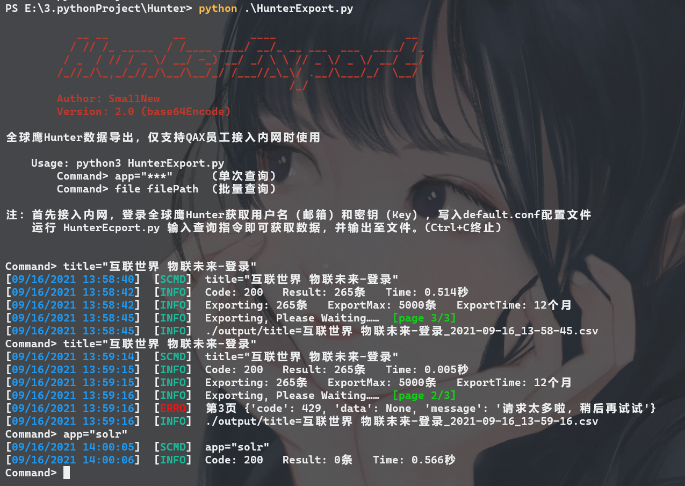
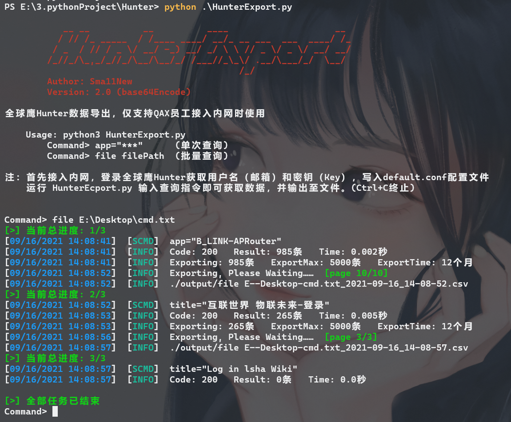
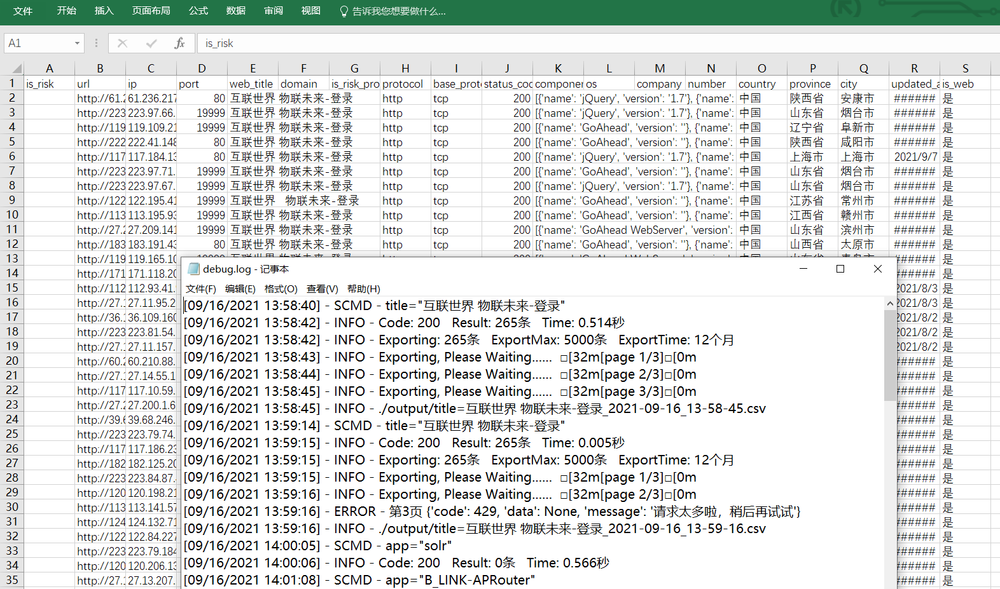

## 🌟HunterExport 全球鹰数据查询导出

由于全球鹰目前仅支持每天导出1000条数据，因此编写了该脚本调用查询API，可无限制导出查询结果至Excel表格。

目前全球鹰仅对公司内部开放，因此全程需要**接入公司内网**，即拨入VPN。接入公司内网后，登录安服武器库全球鹰Hunter获取用户名（邮箱）和密钥（Key），写入default.conf配置文件，运行 HunterEcport.py 输入查询指令即可获取数据，并输出至文件。

### ✨更新

**当前版本为第二版，更新情况如下：**

1.  修复全球鹰加入请求编码后第一版无法使用问题
2.  支持文件批量查询
3.  加入日志系统
4.  增加配置文件项，解决请求出错问题
5.  修复bug，优化程序，完善功能

### 🪓配置文件

-   mail = example@qianxin.com  - 邮箱
-   key = abcdefgh12345678987654321hgfedcba - key
-   countMax  - 导出数量封顶限制，越大越慢，适量增减，单位：条
-   searchMonth  - 查询时间范围，12、24恰当，越长越容易出现死资产，单位：月
-   timeSleep - 请求时延，越小越快，越容易请求错误，0.5s、1s恰当，适量增减，单位：秒
-   isWeb - 是否仅查询web资产，1是2否

按需修改即可。

### 🚩使用

安装环境
```
pip install -r requirements.txt
```

运行
```
Usage: python3 HunterExport.py
    Command> app="***"      (单次查询)
    Command> file filePath  (批量查询)
```

单个查询  `app="***"`  （当前timeSleep为0，会出现请求频率太高）：



文件批量查询  `file filePath` （修改配置问价timeSleep为0.5，请求出错问题解决）：



查询结果及debug.log日志文件：



**欢迎使用**
